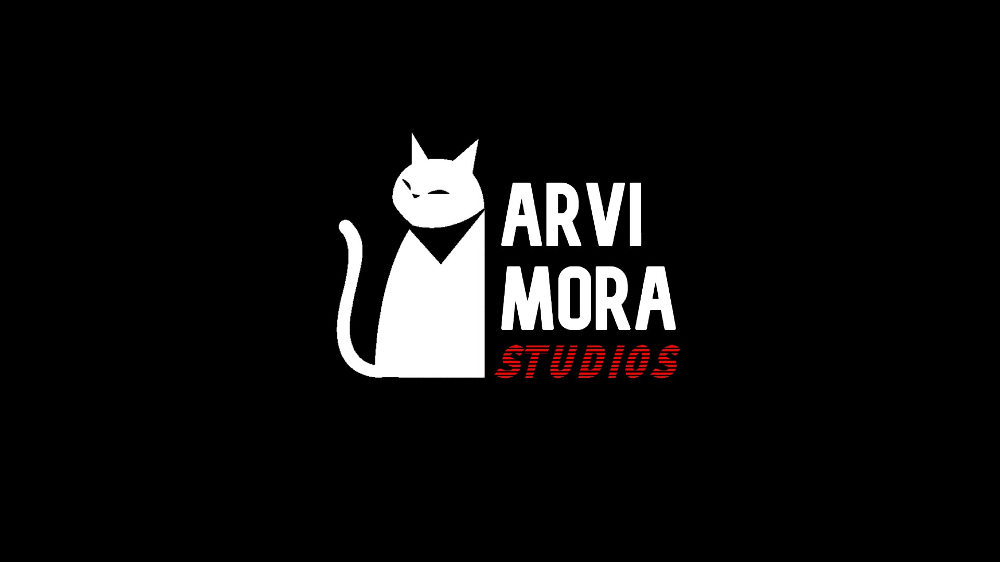
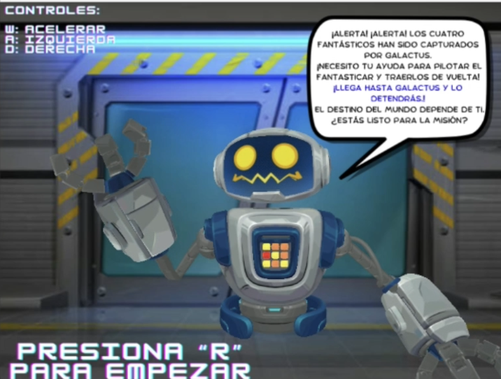
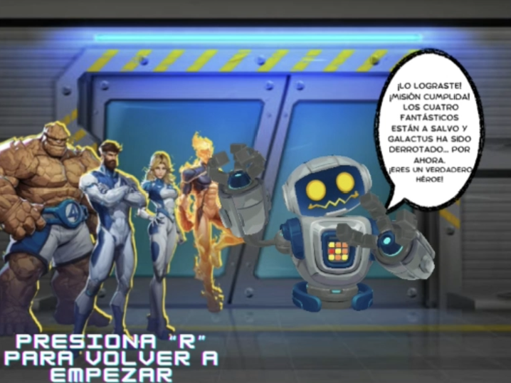
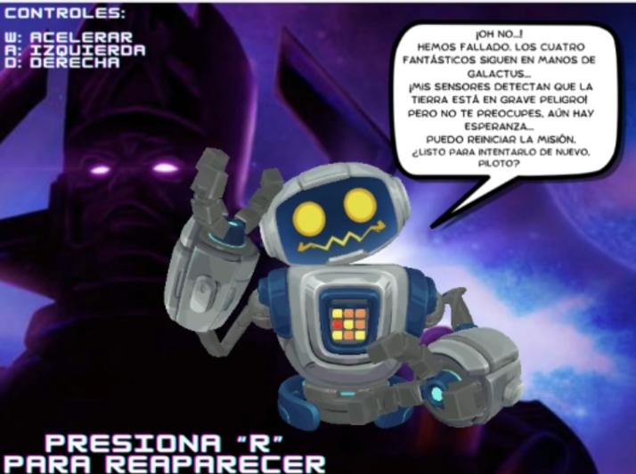

# 2025A_GR1SW_GR4
Fantastic Four Herbie to the Rescue - Demo Interactivo en OpenGL  
**Producto multimedia interactivo desarrollado con OpenGL y OpenAL Soft.**

Demo en C++ que presenta una experiencia inmersiva donde el jugador toma el control, esquivando asteroides y enfrentándote a un colosal Galactus. El entorno cuenta con animaciones, sonido espacial y efectos de iluminación.

---

## 💻 Requisitos

- Visual Studio 2022  
- OpenGL (GLFW, GLAD, GLM)  
- OpenAL Soft (OpenAL32.dll)  
- Archivos de sonido en formato WAV PCM en la carpeta `audio/`  
- Modelos 3D en la carpeta `models/`  

---

## 🐱 ARVI MORA STUDIOS 
Somos un estudio emergente de desarrollo de videojuegos fundado por estudiantes de la EPN. 
En **ARVI MORA STUDIOS** nos apasiona crear experiencias interactivas que mezclan diseño visual, sonido envolvente y narrativas inmersivas.

El nombre **ARVI MORA** nace de la combinación de los apellidos de sus integrantes, como símbolo de identidad, colaboración y unión creativa.

- **AR**IZAGA  
- DA**VI**LA  
- **MO**RALES  
- **RA**MOS

---
## 🕹️ Fantastic Four Herbie to the Rescue 
*"Conduce al límite y salva a los 4 fantásticos de Galactus."*

En esta aventura intergaláctica, el jugador asume el papel del valiente y carismático robot **H.E.R.B.I.E**, quien se embarca en una misión crítica: **rescatar a los miembros de los Cuatro Fantásticos**, que han sido capturados por el imponente **Galactus**, el devorador de mundos. A bordo del legendario **FantastiCar**, deberás abrirte paso a través de un **caótico campo de asteroides**, esquivando peligros cósmicos, acelerando a través del vacío del espacio, y utilizando tu linterna de plasma para atravesar la oscuridad. Esta demo ofrece una experiencia de conducción intensa con elementos de acción y suspenso, todo envuelto en una atmósfera de ciencia ficción y sonido envolvente. 

🌌 **¿Tienes lo que se necesita para salvar al universo?**

---

## 🌠 **Misión**  
Diseñar y desarrollar videojuegos de calidad. Como estudiandes de la EPN, buscamos impulsar el talento joven ecuatoriano, fomentar el trabajo colaborativo y contribuir al crecimiento de la industria del entretenimiento en la región.

---

## 🎯 **Visión**  
Convertirnos en una empresa referente en el desarrollo de videojuegos innovadores en América Latina, destacando por nuestra creatividad, pasión y compromiso con experiencias interactivas que inspiren a jugadores de todo el mundo.

---

## 🎮 Características destacadas

## 🎮 Características destacadas

- ✅ Renderizado 3D en tiempo real con OpenGL  
- 🚧 Esquiva asteroides y avanza con las teclas W, A, D
- 🧠 Galactus con animación de cabeza y ojos  
- 🔥 Llamas que aparecen al acelerar
- 🎧 Sonido 3D (motor, esquivación, música, gritos)  
- 🖼️ Pantallas animadas de Inicio / Victoria / Derrota

| Pantalla de Inicio | Pantalla de Victoria | Pantalla de Derrota |
|--------------------|----------------------|----------------------|
|  |  |  |

  
---

## 🎮 Controles

| Tecla / Acción | Función                          |
|----------------|----------------------------------|
| `W`            | Acelerar                         |
| `A` / `D`      | Mover a izquierda / derecha      |
| `R`            | Iniciar o reiniciar juego        |
| `ESC`          | Salir                            |

---

## 🧱 Modelos utilizados

- **FantastiCar**: `models/FantastiCar+Herbie/`
- **Flama azul**: `models/flama/`
- **Galactus**: `models/Galactus/`
- **Ojos de Galactus**: `models/ojitos/`
- **Asteroides**: `models/asteroid/`  
- **Llamas**: `models/flama/`
- **Skybox de nebulosa**: `models/nebula/`
- **Pantallas animadas**: `models/StartScreen/`, `models/GameOver/`, `models/Win/`  
- **Pantalla del logo del Studio**: `models/initialScreens/`
- **Pantalla del logo del juego**: `models/initialScreens/`

---

## 🔊 Sonidos utilizados

- `audio/gato.wav`: Sonido de estudio
- `audio/intro.wav`: Sonido de logo
- `audio/Lobby.wav`: Música de inicio  
- `audio/InGame.wav`: Música durante el juego  
- `audio/Win.wav`: Música de victoria  
- `audio/Lose.wav`: Música de derrota  
- `audio/Esquiva.wav`: Sonido al esquivar  
- `audio/Speed.wav`: Motor al acelerar  
- `audio/Yei.wav`: Sonido de celebración  
- `audio/Scream.wav`: Sonido de derrota

---

## 👨‍💻 Autores

- Samira Arízaga: [github.com/marcianitauwu](https://github.com/marcianitauwu)  
- Paúl Dávila: [github.com/BaphomeT-T](https://github.com/BaphomeT-T)  
- Salma Morales: [github.com/Salmynj](https://github.com/Salmynj)  
- Sebastián Ramos: [github.com/SebasRCC](https://github.com/SebasRCC)  
